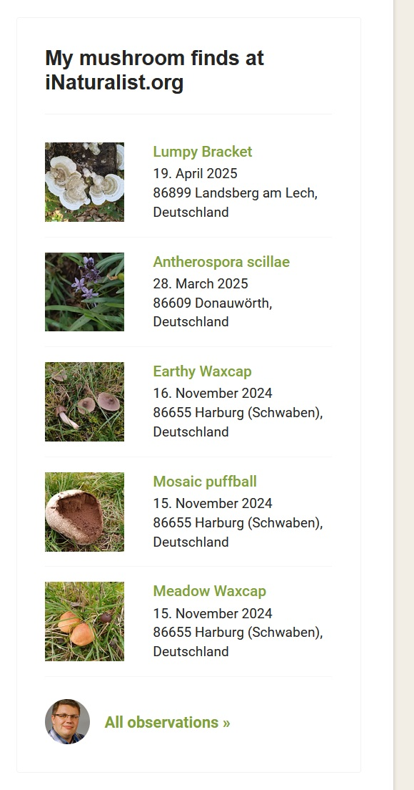
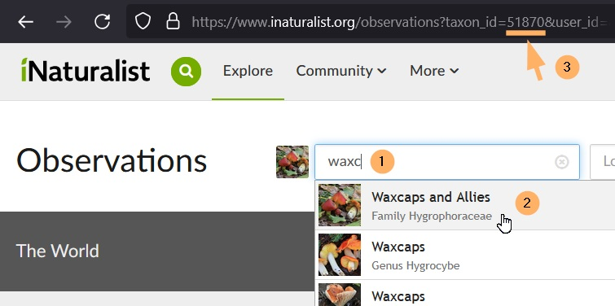

# iNaturalist Observations Module for Joomla!

This module embeds the recent [iNaturalist.org](https://www.inaturalist.org) observations of a specific user in your Joomla!&nbsp;v4/5 based website. You can optionally filter the results by taxon groups such as plants, fungi&nbsp;& lichens, animals, or a custom taxon (ID needed). The module uses server-side caching to reduce API calls, is fully GDPR compliant, and includes multilingual support.

## 🌿 Features

- Displays latest observations from a specific iNaturalist user
- Optional filter by organism group or custom taxon&nbsp;ID
- Configurable number of observations
- Server-side caching (configurable duration)
- Fully GDPR compliant
- Multilingual (English and German)
- Automatic language selection based on the visitor’s site language (species names, dates)
- GPL&nbsp;v3 licensed



## 📦 Installation

1. Download the latest ZIP package from the [Releases](https://github.com/AK-CCM/joomla-inaturalist-observations/releases) section.
2. Install it from the Joomla backend (administration) under *System&nbsp;> Install&nbsp;> Extensions*.
3. Consider the hints below in the section *Protection of cached centent* and follow the instructions if needed.
4. In your Joomla! backend go to *Content&nbsp;> Site Modules*, find **iNaturalist Observations**, and publish it in a suitable position.
5. Configure the module options, especially the required `iNaturalist Username`, `Number of Observations` and `Cache Duration (in hours)`.
6. On Tab *Menu Assignment* define on which menu items and its pages the module should be diplayed.

## ⚙️ Module Options

| **Parameter**                | **Description**                                                                | **Default**     |
|------------------------------|--------------------------------------------------------------------------------|-----------------|
| `iNaturalist Username`*      | The username of the iNaturalist account whose observations should be displayed | `<empty>`       |
| `Taxon Filter`               | Optional: Organism group or custom taxon ID to filter the Observations         | `All Organisms` |
| `iNaturalist Taxon ID`       | If ‘Custom’ is selected: The iNaturalist taxon ID to filter the observations   | `<empty>`       |
| `Number of observations`*    | The number of recent observations to display                                   | `5`             |
| `Cache Duration (in hours)`* | How long the observation data should be cached before a new request is made    | `24`            |

Asterisks mark required module options.

## 🔍 Obtain a Taxon ID

Open the [page with the observations](https://www.inaturalist.org/observations) on iNutarlist.org and enter the name of the desired taxon in the search field&nbsp;(1). This can be either the scientific name or the name in a national language; often fragments are enough for the taxon you are looking for to appear in the list of suggestions. Now click/tap on the desired taxon&nbsp;(2) and search for the parameter ‘taxon_id’ in the address bar. The sequence of digits&nbsp;(3) there is the taxon ID that must be stored in the module option `iNaturalist Taxon ID` for customised filtering of the observations.



## 🔒 Protection of Cached Content

To prevent search engines from indexing and accessing cached texts and images, the two files `robots.txt` and `.htaccess` are created in the cache directory when the module is installed. While robots.txt serves as a polite request to the search engines not to crawl and index the cached content, server rules (e.g.&nbsp;.htaccess) block access by force.

### 🤖 robots.txt

Even though direct access to the cache directory is already blocked via .htaccess file (Apache Webserver) or nginx configuration file, a robots.txt file is still included for additional protection:

```
User-agent: *  # The rule applies to all web crawlers
Disallow: /  # Block crawlers from accessing the directory
```

### 🪶 .htaccess (Apache Webserver)

If the automatic setup of the .htaccess file doesn't work due to a lack of authorisations, please add the following lines manually to the .htaccess file in the cache directory:

```
# Prevents direct access to all files in the cache directory
<Files *>
    Order Deny,Allow
    Deny from all
</Files>

# Prevents the indexing and display of content by search engines
<IfModule mod_headers.c>
    Header set X-Robots-Tag "noindex, nofollow, noarchive, nosnippet"
</IfModule>
```

### 🚀 Configuration (nginx Webserver)

nginx webserver does not support .htaccess files. Please add the following rules to the central configuration file `/etc/nginx/nginx.conf` to protect the cache directory:
```
location /cache/mod_inaturalist_observations/ {
    # Prevents access to the cache directory
    deny all;  
    # Returns the HTTP error code 403 if the directory is tried to be accessed
    return 403;
    # Prevents search engines from indexing and displaying the content
    add_header X-Robots-Tag "noindex, nofollow, noarchive, nosnippet";
}
```

## 📄 Privacy Policy Draft

```
iNaturalist

This website includes content (e.g. images and metadata of observed organisms) from iNaturalist. This is an online platform for observing nature where users worldwide can document and share findings of plants, animals and other organisms. The provider is the California Academy of Sciences, 55 Music Concourse Dr, San Francisco, CA 94118, USA.

However, the content is not loaded directly from the provider's servers, but is first stored temporarily on our own web server (caching) and then delivered from there. This prevents a direct connection to iNaturalist servers being established when the content is accessed and, for example, your IP address being transmitted.

Please note that when you click on linked observations or the link to all observations of the website operator, a direct connection to the iNaturalist servers is established. Personal data (such as your IP address) may be collected and processed by the provider. We have no influence on this data processing.

You can find more information on data protection at iNaturalist here: https://www.inaturalist.org/pages/privacy.
```

## 📜 License

This module is released under the [GNU General Public License v3.0](https://www.gnu.org/licenses/gpl-3.0.html).

## ✨ What's Next?

This module works as intended, but I won’t be actively developing it further. I’m not a professional developer, and without the help of ChatGPT (OpenAI GPT-4), I wouldn’t have been able to create it.

If you find it useful and want to improve or extend it, feel free to fork the repository. While I won’t be adding new features, I hope the module can still be valuable to the Joomla! and iNaturalist communities.

## ⚖️ Trademark Disclaimer

This repository is not affiliated with or endorsed by the Joomla! Project or the iNaturalist platform.  
It is neither supported nor guaranteed by Joomla!, Open Source Matters, or the California Academy of Sciences (iNaturalist).

<!-- Topics: joomla-module joomla4 joomla5 inaturalist nature-observations citizen-science gplv3 open-source php -->
